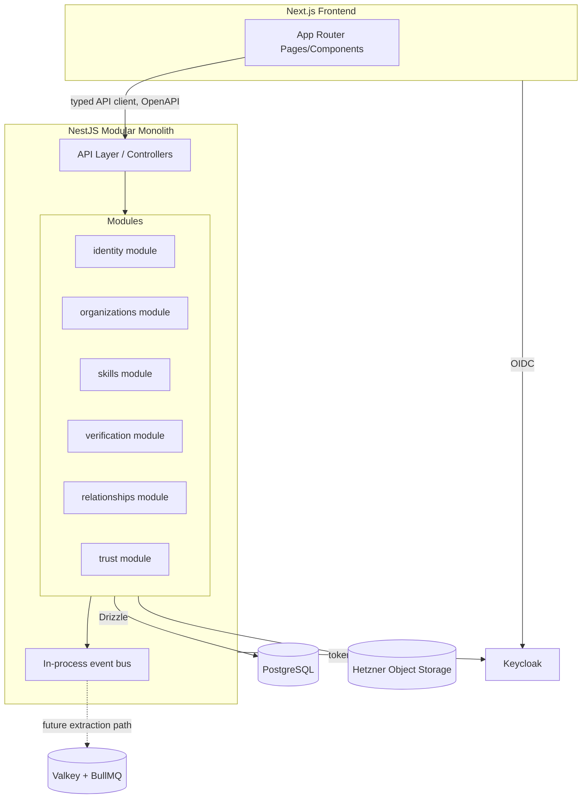

# Architecture

> Status: **Mixed.** The "Current State" section below is a factual description of what's in this repository today, verified against the source. The "Target Architecture" section is the direction all backend/platform work must follow once it begins. There is currently a complete gap between the two — see the [Engineering Report](./engineering-report.md) for what that means for sequencing.

## Current State (verified against source, 2026-07)

This repository currently contains **one static marketing/demo site**, not the smartest.network product.

### What exists

- **`index.html`** — the public landing page.
- **`vision.html`** — the "Vision & Entwicklung" storytelling subpage.
- **`_ds/industry-95c656ac.../`** — the "Industry" design system: `styles.css` (design tokens + component classes), `_ds_bundle.js`, a manifest, and a readme. This is the actual, real, reusable design system — see [`ui-principles.md`](./ui-principles.md).
- **`support.js`** — a third-party runtime ("dc-runtime", generated, not hand-authored — the file header says `// GENERATED from dc-runtime/src/*.ts — do not edit`) that parses the `<x-dc>` custom-element document format each page is written in, and renders it via React loaded dynamically from a CDN (`unpkg.com/react`, `react-dom`, `@babel/standalone`) at page-load time. Each page defines a `class Component extends DCLogic { renderVals() {...} componentDidMount() {...} }` in an inline `<script type="text/x-dc" data-dc-script">` block. This is the origin format produced by the claude.ai "Design" canvas tool this site was built with — it is not a hand-rolled framework and should not be extended as if it were one (see "What NOT to do" below).
- **`image-slot.js`** — a custom element (`<image-slot>`) handling image placeholder/upload states independently of the dc-runtime.
- **`assets/`** — two images (`hero-network.png`, `founder-photo.png`).
- **No `package.json`, no build step, no bundler, no test runner, no backend, no database.** Every byte served is a static file.

### How it's deployed

GitHub Pages, serving this repository's `main` branch root directly (`.nojekyll` present, `CNAME` pointing the custom domain `smartest-network-demo.florian-kratzer.com` at it). See [`deployment.md`](./deployment.md) for the full current workflow. There is no CI pipeline, no staging environment, no build artifact — `git push` to `main` *is* the deploy.

### What NOT to do with the current code

- **Do not hand-write new pages against the `dc-runtime`/`<x-dc>` format going forward.** It exists because these two pages were produced by an external design tool, not because it's this project's chosen frontend architecture. New product surfaces should be built in the target stack (Next.js/React/TypeScript — see below), not as additional `.dc.html`-style pages.
- **Do not treat `support.js` or `_ds_bundle.js` as editable application code.** They're generated/vendored. If the design system needs a new component class, add it to `_ds/.../styles.css` by hand (this is already the established pattern — see the `git log` for `_ds/industry-.../styles.css`) — don't touch the generated JS.
- **Do not add a backend, database, or business logic to this repository's current static-site code.** The moment real domain logic is needed, it belongs in the target-architecture backend described below, not bolted onto the marketing site.

## Target Architecture

### Style: Modular Monolith

**One deployable backend service**, internally divided into modules that mirror the domain model (`docs/domain-model.md`): `identity`, `organizations`, `skills`, `verification`, `relationships`, `trust`. Not microservices.

Why (full reasoning in [ADR-0001](./adr/0001-modular-monolith.md)): at this product stage, the team is small, the domain is still being learned, and the cost of premature service boundaries (network calls where a function call would do, distributed transactions for what's really one consistency boundary) is higher than the cost of a monolith that's disciplined about internal module boundaries. Module boundaries are enforced at the *code* level (see Clean Architecture below) so that splitting a module out into its own service later — if and when it earns that — is a mechanical extraction, not a rewrite.

### Style: Domain-Driven Design

Each module owns its slice of the domain model and exposes it only through an explicit application-layer interface — no module reaches into another module's database tables or ORM entities directly. Cross-module communication goes through in-process application services (method calls today; swappable for message-based calls later without changing calling code, if a module is ever extracted — see "Event-Ready" below).

### Style: Clean Architecture (per module)

Each module is internally layered:

```
domain/         — entities, value objects, domain events, pure business rules. No framework imports.
application/    — use cases / application services. Orchestrates domain objects. Depends on domain, not on infrastructure.
infrastructure/ — Drizzle repositories, external API clients, framework glue (NestJS controllers/providers).
```

Dependency direction is inward only: `infrastructure` depends on `application` depends on `domain`. `domain` depends on nothing NestJS- or Drizzle-specific. This is what makes the domain model in `domain-model.md` testable without a database and swappable at the infrastructure edges without touching business rules — see [`coding-standards.md`](./coding-standards.md) for the concrete rules this implies (no ORM decorators on domain entities, no NestJS decorators outside `infrastructure`, etc.).

### Style: API-First

The NestJS backend's HTTP API is the contract. The OpenAPI schema is generated from the backend, not hand-maintained separately, and the Next.js frontend consumes it through a generated typed client — never hand-written `fetch` calls with inline response shapes. See [`api-guidelines.md`](./api-guidelines.md). No business logic lives in the frontend (`coding-standards.md`); the frontend's job is presentation and orchestration of API calls, full stop.

### Style: Event-Ready

Domain-significant state changes (a `Relationship` reaching `cooperation_completed`, a `Verification` being issued) are modeled as domain events *within* the modular monolith from day one — published in-process today (e.g. via a simple in-process event emitter or NestJS's built-in `EventEmitter2`), even before Valkey/BullMQ-backed async processing exists. This matters because:

1. `TrustScore` recomputation, per `domain-model.md`, is explicitly a triggered recalculation, not a live-mutated value — it should be triggered by an event, not called synchronously from deep inside a `Relationship` update.
2. It keeps the door open to move specific event handlers onto the Valkey/BullMQ queue (async, retryable, observable) purely as an infrastructure change, without touching the module that publishes the event.

Don't build a message bus prematurely — an in-process event emitter is sufficient until there's a concrete need (a slow handler, a need for retries, a need for a module extraction) for the queue.

### SOLID and Composition over Inheritance

Standard, but worth stating what it rules out concretely for this codebase:

- **Single Responsibility**: a NestJS service class that both talks to the database *and* contains matching/scoring logic is wrong — split into a repository (infrastructure) and a domain/application service.
- **Dependency Inversion**: application services depend on repository *interfaces* defined in `domain/`, implemented in `infrastructure/`, injected via NestJS DI (see `coding-standards.md`).
- **Composition over inheritance**: no deep class hierarchies for domain entities (e.g. no `abstract class NetworkParty` that `Person` and `Organization` both extend to share fields). Where `Person` and `Organization` share shape (as they do throughout `domain-model.md` via `subjectType`/`subjectId` polymorphism), prefer shared value objects and interfaces, composed in, over inheritance.

## Frontend Architecture (target)

Next.js (App Router) + React + TypeScript, consuming the NestJS API through a generated typed client. Server Components by default; Client Components only where interactivity requires it (forms, the kind of scroll-driven animation already proven out in `vision.html` — see `ui-principles.md` for how that pattern should be re-implemented as a proper React component rather than the current inline dc-runtime script). No business logic (matching rules, trust calculations, verification logic) in frontend code, ever — that's a `coding-standards.md` rule, not a suggestion, because it's the only way `domain-model.md`'s trust guarantees hold: a client-side trust calculation is a client-side trust calculation someone can forge in devtools.

## Diagram: target module boundaries



## Change control

Any deviation from this document (a new module boundary, a decision to extract a service, a new cross-cutting concern) requires an ADR in `docs/adr/` before implementation — see [`constitution.md`](./constitution.md) and [`CLAUDE.md`](../CLAUDE.md). This document is updated in the same PR as the ADR that changes it, not after the fact.
