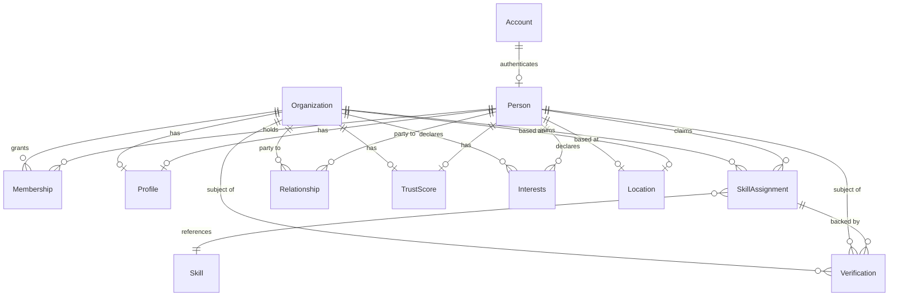

# Domain Model

> Status: **Target — not yet implemented.** No database, ORM schema, or backend exists in this repository yet (see the [Engineering Report](./engineering-report.md)). This document is the authoritative shape for the domain model when the backend is built. Treat it as the contract: implementation follows this document, not the other way around — changes to the model go through an ADR (see [`adr/README.md`](./adr/README.md)) before the schema changes.

## Why this document exists

Per [`product-principles.md`](./product-principles.md) principle 3 ("structured data before free text"), the domain model *is* the product. A generic `jsonb` blob is not an acceptable substitute for any entity described here. Drizzle ORM schema definitions (once written) should map onto these entities close to 1:1 — see [`technology-stack.md`](./technology-stack.md) and [ADR-0003](./adr/0003-drizzle-orm.md).

## Design rules that apply to every entity

- **Every entity has a stable, immutable surrogate ID** (UUID). Natural keys (email, VAT ID) are unique constraints, never primary keys — they change.
- **Soft-delete over hard-delete** for anything another entity can reference (`Person`, `Organization`, `Relationship`, `Verification`). Cooperation history and trust provenance must survive a party leaving the network.
- **Every mutation is attributable.** `createdBy` / `updatedBy` referencing `Account`, plus `createdAt` / `updatedAt`, on every table. This is a prerequisite for `Verification` and `TrustScore` to mean anything (see `security.md` on audit trails).
- **No entity self-declares trust.** Any field that affects `TrustScore` must originate from a `Verification` record, not a plain user-editable column. This is `product-principles.md` principle 2, enforced structurally.

## Entity overview

## Entities

### Account

The authentication identity. One `Account` per login credential, 1:1 with a Keycloak user (see [ADR-0004](./adr/0004-keycloak-authentication.md)). This is deliberately separate from `Person`: an `Account` is "who can log in," a `Person` is "who this human is in the network." Keeping them separate means auth provider migrations or credential changes (email change, SSO re-linking) never touch domain data.

| Field | Notes |
|---|---|
| `id` | UUID, matches Keycloak subject claim |
| `email` | Unique, verified via Keycloak, not user-editable outside the auth flow |
| `status` | `active \| suspended \| deleted` |
| `lastLoginAt` | For security/session review, not analytics |

**Responsibility:** authentication and account lifecycle only. Holds no profile, trust, or relationship data.

### Person

A human participant, always acting in the context of at least one `Organization` (per `product-principles.md` principle 1 — a `Person` is never a free-floating profile).

| Field | Notes |
|---|---|
| `id` | UUID |
| `accountId` | FK → `Account`, 1:1 |
| `givenName`, `familyName` | Structured, not a single "full name" free-text field — needed for formal/verification contexts |
| `status` | `active \| inactive \| deleted` |

**Responsibility:** identity of the human. Does not hold role or organizational context directly — that's `Membership`'s job, because a person's relationship to an organization changes over time and a person may (rarely, sequentially) represent more than one.

### Organization

A company, research institution, or other legal entity participating in the network.

| Field | Notes |
|---|---|
| `id` | UUID |
| `legalName` | Structured, verifiable against a business register |
| `displayName` | May differ from legal name (brand name) |
| `type` | `sme \| enterprise \| research_institution \| public_body \| other` — drives which `SkillAssignment`/`Interests` vocabularies are suggested |
| `registrationId` | Business register ID (e.g. Handelsregisternummer), used as the anchor fact for `Verification` |
| `locationId` | FK → `Location` |
| `status` | `active \| inactive \| deleted` |

**Responsibility:** the primary "unit" of the network per `product-principles.md`. Everything else (skills, interests, trust, cooperation) ultimately rolls up to an `Organization` even when represented by a `Person`.

### Membership

The join between `Person` and `Organization` — who represents which organization, with what authority, over what period. This is where "acting on behalf of" lives, deliberately separated from `Person` and `Organization` themselves so that history (a person changing employer) doesn't corrupt either entity's own record.

| Field | Notes |
|---|---|
| `id` | UUID |
| `personId` | FK → `Person` |
| `organizationId` | FK → `Organization` |
| `role` | `owner \| admin \| representative \| member` — governs what the person may do on the organization's behalf, including whether they can accept `Relationship` requests or trigger `Verification` flows |
| `startedAt`, `endedAt` | `endedAt` null = current. Never delete a `Membership` row — history matters for trust provenance |
| `status` | `active \| revoked` |

**Responsibility:** authorization boundary and organizational history. This is the table that answers "was this person actually allowed to act for this organization on this date" — which matters retroactively when a `Relationship` or `Verification` is disputed.

### Profile

Presentational and biographical content for a `Person` or `Organization` — the free-text-permitted surface, per `product-principles.md` principle 3 ("free text is allowed for genuinely unstructured content").

| Field | Notes |
|---|---|
| `id` | UUID |
| `subjectType` | `person \| organization` |
| `subjectId` | FK, polymorphic on `subjectType` |
| `headline` | Short structured summary line |
| `description` | Free text — the one place on the entity where it's appropriate |
| `logoUrl` / `photoUrl` | Points into Hetzner Object Storage (see `technology-stack.md`) |

**Responsibility:** presentation only. Never a source of truth for skills, trust, or matching — those live in their own structured entities. If a matching or trust decision would ever need to read `Profile.description`, that's a signal something should have been modeled as a field instead.

### Skill

A controlled-vocabulary reference entity — the taxonomy of competencies the network understands, not a free-text tag.

| Field | Notes |
|---|---|
| `id` | UUID |
| `name` | Canonical, unique |
| `category` | e.g. `technology \| domain \| methodology` |
| `parentSkillId` | Nullable self-FK — allows a taxonomy hierarchy (e.g. "Machine Learning" under "Künstliche Intelligenz") |

**Responsibility:** the shared vocabulary. Adding a new `Skill` is a curated, reviewed action (not arbitrary user input) — this is what keeps `SkillAssignment` structured instead of degrading into free-text tags with a thousand near-duplicate spellings.

### SkillAssignment

The claim that a `Person` or `Organization` has a given `Skill`, and (critically) whether that claim is verified.

| Field | Notes |
|---|---|
| `id` | UUID |
| `subjectType` | `person \| organization` |
| `subjectId` | FK, polymorphic |
| `skillId` | FK → `Skill` |
| `proficiency` | `declared \| verified` — starts `declared`, only becomes `verified` via a linked `Verification` record |
| `verificationId` | Nullable FK → `Verification` |

**Responsibility:** links a subject to the skill taxonomy, and carries the declared-vs-verified distinction that downstream matching and `TrustScore` calculations depend on.

### Verification

The record of a checked, evidenced fact about a `Person`, `Organization`, or `SkillAssignment`. This is the single mechanism behind every trust signal in the system — see `product-principles.md` principle 2.

| Field | Notes |
|---|---|
| `id` | UUID |
| `subjectType` | `person \| organization \| skill_assignment` |
| `subjectId` | FK, polymorphic |
| `method` | `business_register_check \| credential_check \| completed_cooperation \| peer_attestation \| other` |
| `verifiedBy` | FK → `Account` (system process or authorized staff) or null for automated checks |
| `evidenceRef` | Pointer to supporting evidence (document in Object Storage, external register reference) |
| `verifiedAt` | Timestamp |
| `expiresAt` | Nullable — some verifications (e.g. a register check) should be periodically re-confirmed |

**Responsibility:** the only writer of trust-affecting facts. No other entity is allowed to mark itself "verified" directly.

### Relationship

A connection between two parties in the network graph — the literal edge that the "Verbindungen" stage of the product vision refers to.

| Field | Notes |
|---|---|
| `id` | UUID |
| `partyAType`, `partyAId` | Polymorphic: `person \| organization` |
| `partyBType`, `partyBId` | Polymorphic |
| `type` | `connection \| cooperation_pending \| cooperation_active \| cooperation_completed` — the lifecycle from the vision's "Verbindungen → Kooperation" stages lives in this field |
| `initiatedBy` | FK → `Account` |
| `status` | `pending \| accepted \| declined \| ended` |

**Responsibility:** the graph structure itself. A completed `cooperation_completed` relationship is the input event that a `TrustScore` recalculation and (eventually) recommendation-quality improvement are triggered from — this is the literal implementation of the network-effect loop described in `vision.md`.

> **Open modeling question, deliberately deferred:** a `Relationship` in `cooperation_*` status likely needs its own richer `Cooperation` entity (scope, outcome, participants beyond two parties) once that part of the product is built. Not specified here — extend this document with an ADR-backed proposal before implementing, per `constitution.md`.

### TrustScore

A derived, versioned score for a `Person` or `Organization`, computed from `Verification` and completed `Relationship` history — never directly editable.

| Field | Notes |
|---|---|
| `id` | UUID |
| `subjectType` | `person \| organization` |
| `subjectId` | FK, polymorphic |
| `score` | Numeric, algorithm-defined range |
| `computedAt` | Timestamp — scores are recomputed events, not live-mutated state |
| `basis` | Structured breakdown referencing the `Verification`/`Relationship` records that contributed, for explainability |

**Responsibility:** the output of the trust mechanism, not an input to it. The calculation method itself is a product/algorithm decision to be specified separately (and will need its own ADR before implementation, given how central it is) — this table only defines the shape the result is stored in, including that it must be explainable (`basis`), not a black-box number.

### Interests

What a `Person` or `Organization` is looking for — the structured counterpart to the landing page's "Wonach suchen Sie?" use cases (KI-Partner, Cybersecurity-Experte, Forschungspartner, etc.). Modeled the same way as `Skill`/`SkillAssignment` (controlled vocabulary + assignment), because "what I'm looking for" and "what I offer" are symmetric matching inputs.

| Field | Notes |
|---|---|
| `id` | UUID |
| `subjectType` | `person \| organization` |
| `subjectId` | FK, polymorphic |
| `interestTypeId` | FK → controlled `InterestType` vocabulary (same pattern as `Skill`) |
| `priority` | Optional ranking among a subject's declared interests |

**Responsibility:** the demand side of matching, mirroring `SkillAssignment` as the supply side.

### Location

Structured location for a `Person` or `Organization` — never a free-text "based in..." field, per `product-principles.md` principle 3.

| Field | Notes |
|---|---|
| `id` | UUID |
| `country` | ISO 3166-1 alpha-2 |
| `region` | State/Bundesland, structured |
| `city` | Structured |
| `postalCode` | Optional |
| `geo` | Optional lat/lng, for proximity-based matching |

**Responsibility:** geographic anchor for filtering and proximity matching. One `Location` may be referenced by multiple `Organization`/`Person` rows (a shared office address) — it's a reference entity, not owned by a single subject.

## What's intentionally not modeled yet

- **Cooperation** (the rich version, beyond a `Relationship` status) — see the open question under `Relationship` above.
- **Event** (matching events, conferences referenced on the landing page) — not modeled; the landing page's "Veranstaltungen" section is currently static demo content with no backing entity.
- **Content/Knowledge** (the landing page's "Wissensbereich" articles) — likely a separate, lower-stakes content model (CMS-like), not part of the trust/matching core. Do not conflate it with this domain model when it's built.

These are flagged, not designed, deliberately — per `product-principles.md` principle 6 (simplicity over speculative completeness), they get modeled when a concrete feature needs them, with an ADR, not preemptively here.
